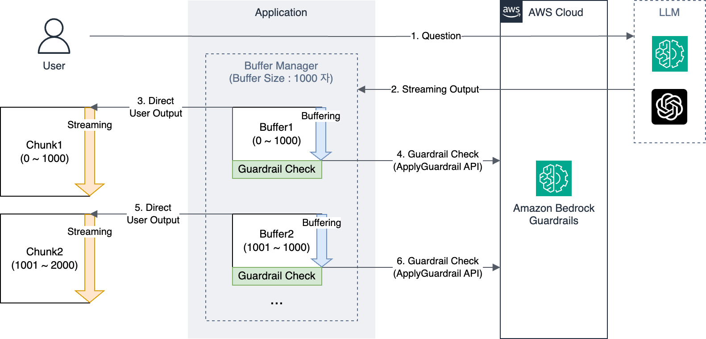
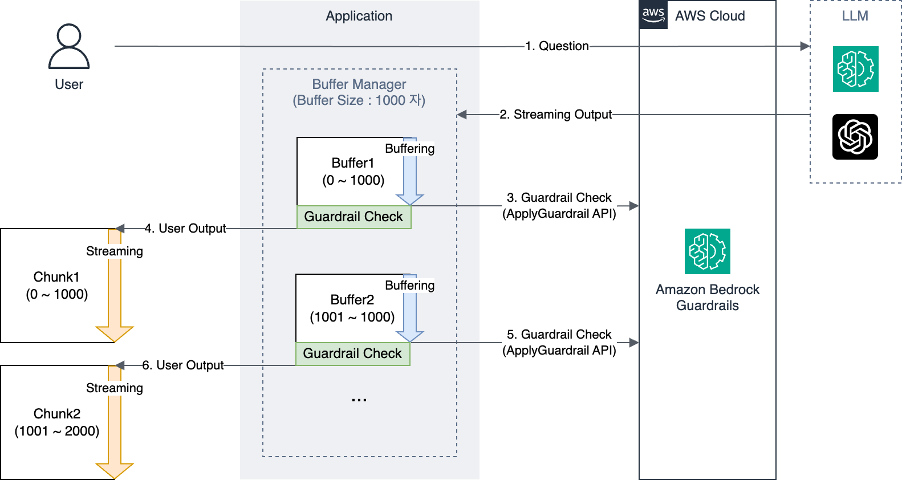
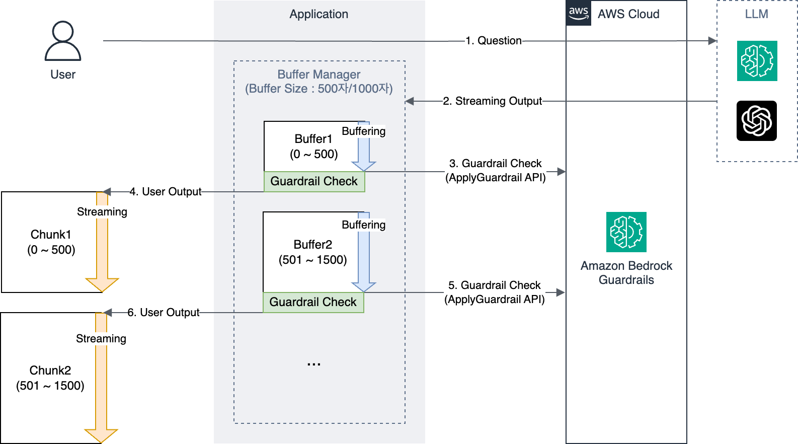

# Bedrock Guardrails Demo

Amazon Bedrock Guardrails를 활용한 LLM 출력 제어 데모 애플리케이션입니다.

## 아키텍처

이 프로젝트는 세 가지 다른 접근 방식의 버퍼 관리자를 제공합니다:

### Post-Guardrail 방식

- 실시간 스트리밍 우선
- 버퍼 크기: 1000자 (0 ~ 1000자 선택 가능)
- 텍스트를 먼저 출력 후 가드레일 검사
- 빠른 응답속도 우선

### Pre-Guardrail 방식

- 안전성 우선
- 버퍼 크기: 1000자 (0 ~ 1000자 선택 가능)
- 가드레일 검사 후 승인된 텍스트만 출력
- 높은 안전성 제공

### Dynamic Buffer 방식

- 하이브리드 접근
- 초기 버퍼: 500자 (0 ~ 1000자 선택 가능)
- 이후 버퍼: 1000자 (0 ~ 1000자 선택 가능)
- 초기 응답은 빠르게, 이후는 안전하게 처리

## 사용 예시

### Post-Guardrail 방식 (실시간 스트리밍)
```python
# 버퍼 크기 1000자로 설정하여 실시간 출력 후 검사
buffer_manager = PostGuardrailManager(
    placeholder=st.container(),
    buffer_size=1000,
    guardrail_config={
        "region": st.secrets["GUARDRAIL_REGION"],
        "guardrail_id": st.secrets["GUARDRAIL_ID"],
        "guardrail_version": st.secrets["GUARDRAIL_VERSION"]
    },
    debug_mode=True
)

# 스트리밍 응답 처리
response = buffer_manager.process_stream(llm_response)
```

### Pre-Guardrail 방식 (지연 처리)
```python
# 버퍼 크기 1000자로 설정하여 검사 후 출력
buffer_manager = PreGuardrailManager(
    placeholder=st.container(),
    buffer_size=1000,
    guardrail_config={
        "region": st.secrets["GUARDRAIL_REGION"],
        "guardrail_id": st.secrets["GUARDRAIL_ID"],
        "guardrail_version": st.secrets["GUARDRAIL_VERSION"]
    },
    debug_mode=True
)

# 스트리밍 응답 처리
response = buffer_manager.process_stream(llm_response)
```

### Dynamic Buffer 방식 (동적 버퍼)
```python
# 초기 버퍼 500자, 이후 버퍼 1000자로 설정
buffer_manager = DynamicGuardrailManager(
    placeholder=st.container(),
    initial_buffer_size=500,
    subsequent_buffer_size=1000,
    guardrail_config={
        "region": st.secrets["GUARDRAIL_REGION"],
        "guardrail_id": st.secrets["GUARDRAIL_ID"],
        "guardrail_version": st.secrets["GUARDRAIL_VERSION"]
    },
    debug_mode=True
)

# 스트리밍 응답 처리
response = buffer_manager.process_stream(llm_response)
```

## 설치 방법

```bash
# 저장소 클론
git clone https://github.com/kwangwl/bedrock_guardrails_streaming.git

# 의존성 설치
pip install -r requirements.txt
```

##  환경 설정 가이드

### 사전 요구사항

- AWS 계정
- Python 3.8 이상
- pip (Python 패키지 관리자)

### AWS 설정

1. AWS CLI 설치
```bash
# Windows
msiexec.exe /i https://awscli.amazonaws.com/AWSCLIV2.msi

# Mac
brew install awscli

# Linux
curl "https://awscli.amazonaws.com/awscli-exe-linux-x86_64.zip" -o "awscliv2.zip"
unzip awscliv2.zip
sudo ./aws/install
```

2. AWS 자격 증명 설정
```bash
aws configure
```

## 프로젝트 설정

### 1. 저장소 클론
```bash
git clone https://github.com/your-repo/bedrock-guardrails-demo.git
cd bedrock-guardrails-demo
```

### 2. 가상환경 생성 및 활성화
```bash
# 가상환경 생성
python -m venv venv

# 가상환경 활성화
# Windows
venv\Scripts\activate
# Mac/Linux
source venv/bin/activate
```

### 3. 의존성 설치
```bash
pip install -r requirements.txt
```

### 4. Streamlit 설정 파일 생성
**.streamlit/secrets.toml** 파일을 생성하고 다음 내용을 추가:
```bash
GUARDRAIL_REGION = "your-aws-region"
GUARDRAIL_ID = "your-guardrail-id"
GUARDRAIL_VERSION = "your-guardrail-version"
```

## 실행 방법

### 1. 애플리케이션 실행
```bash
streamlit run main.py
```

### 1. 브라우저 접속
```bash
기본 URL: http://localhost:8501
```
